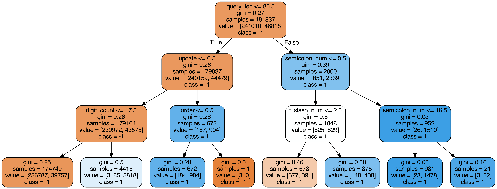

# URL Classifier

This folder contains the Python code for training a classifier for determining whether or not a URL is malicious.

### Feature Selection

I handcrafted several features from just the URL strings themselves, summarized by the following list:
* Length of URL (in characters)
* Length of URL query (in characters)
* Number of digits in URL
* Number of `token=` occurrences in URL
* Counts of suspicious words in URL (i.e. "banking", "paypal")
* counts of special characters  in URL (i.e. "&", "%")

These features were determined from comparing the distributions of such features between the malicious and benign URLs. The disparity of the values for these features between the two categories plus the empirical evaluation indicates that they are strong features.

### ML Model

Because the majority of features are binary in nature, the Random Forest model ended up being a strong classifier for making decisions from a cascaded set of classifiers. From a train/test split of 70/30 with the `n_estimators` hyperparameter set to 100, the model seemed to perform quite well with an accuracy slightly north of 90%.

### Visualization

The full random forest uses 60 different features. The below is a visualization of the random forest classifier with maximum depth of 5, which is meant to highlight some of the more indicative attributes for determining whether the URL is malicious.

